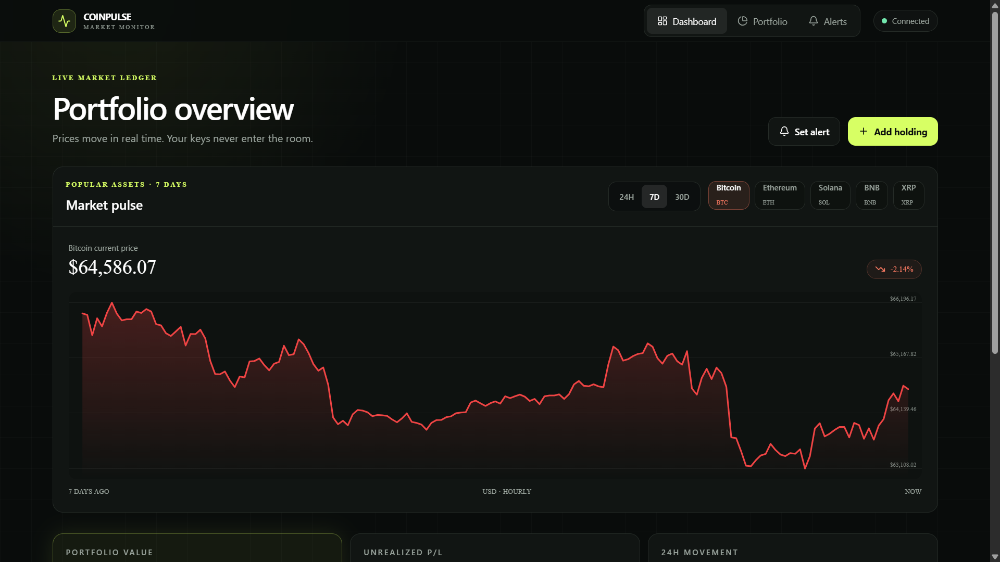
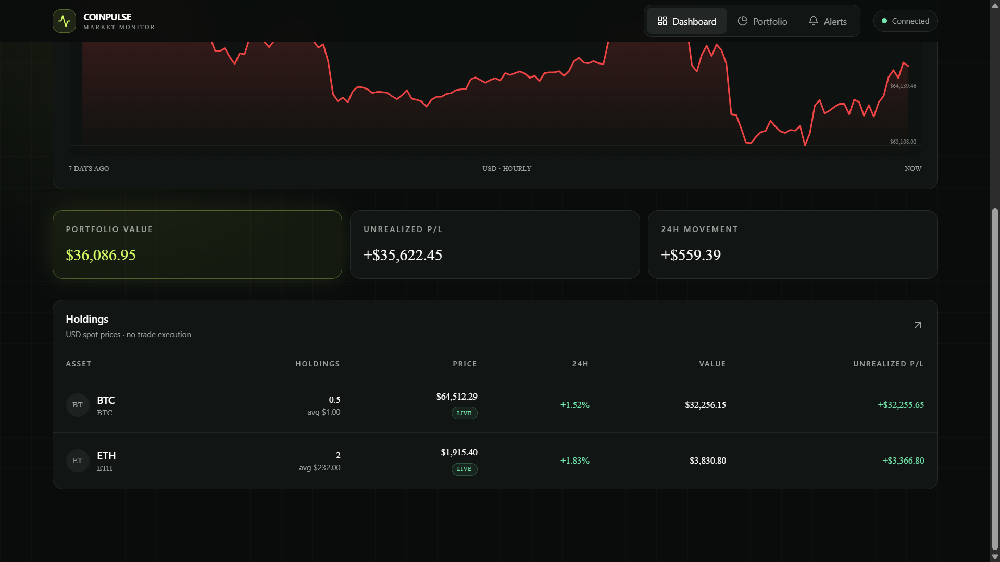

# 🪙 CoinPulse — Crypto Portfolio & Market Tracker

A real-time cryptocurrency tracking and portfolio management dashboard built with **React 18**, **React Router v7**, **Zustand**, **TanStack React Query**, **Lucide Icons**, **Tailwind CSS**, and **Vite**.

👉 **Live Deployment:** [crypto-portfolio-tracker.vercel.app](https://crypto-portfolio-tracker-sandy.vercel.app/)
---

## 🖼️ Application Showcase

| **Crypto Market Dashboard** | **Portfolio & Asset Allocations** |
| :---: | :---: |
|  |  |
| *Live coin prices, 24h market trends & search* | *Personal holdings tracking, P&L & custom price alerts* |

---

## ✨ Key Features

- 📊 **Real-Time Crypto Market Dashboard**:
  - Live cryptocurrency prices, 24h percentage changes, market cap, and volume metrics fetched via CoinGecko API.
  - Search and filter top cryptocurrencies instantly.
- 💼 **Personal Portfolio Management**:
  - Add, edit, and remove crypto asset holdings.
  - Automatically calculates total portfolio valuation, profit/loss (P&L), and percentage allocation breakdown.
  - Persistent holdings state using **Zustand** local storage synchronization.
- 🔔 **Custom Price Alerts System**:
  - Set custom high/low price thresholds for any tracked cryptocurrency.
  - Instant status indicators and trigger logs when price points are reached.
- ⚡ **TanStack React Query Caching**:
  - Intelligent background data polling, refetch intervals, and query caching for zero lag.
- 🎨 **Modern Dark Mode Cinema UI**:
  - Styled with **Tailwind CSS** and **Lucide React** icons for a responsive, sleek trading desk aesthetic across desktop and mobile.
- ⚙️ **Vercel Single-Page App Ready**:
  - Pre-configured `vercel.json` rewrite rules for seamless client-side route handling.

---

## 🛠️ Tech Stack

| Technology | Purpose |
| :--- | :--- |
| **React 18** | Modern UI framework & component management |
| **React Router v7** | Client-side routing across Dashboard, Portfolio & Alerts |
| **Zustand** | Lightweight, persistent state management for portfolio & alerts |
| **TanStack React Query (v5)** | Async data fetching, caching & background sync |
| **Axios** | HTTP requests to CoinGecko REST endpoints |
| **Lucide React** | Modern UI icon library |
| **Tailwind CSS** | Responsive dark mode styling & layout |
| **Vite** | Fast development server & production build tool |
| **Vitest & React Testing Library** | Unit testing framework for components and stores |

---

## 🚀 Getting Started

### Prerequisites

Ensure **Node.js** (v18 or higher recommended) is installed on your computer.

### Installation & Local Run

1. Navigate to the project directory:
   ```bash
   cd your_path
   ```

2. Install dependencies:
   ```bash
   npm install
   ```

3. Start the development server:
   ```bash
   npm run dev
   ```

4. Open `http://localhost:5173` in your browser.

### Running Tests

```bash
# Run unit & integration tests
npm run test
```

### Production Build

```bash
# Build optimized production bundle
npm run build

# Preview production build locally
npm run preview
```

---

## 📁 Project Structure

```
back2/
├── images/                  # Application screenshots & README showcase images
│   ├── preview-1.png        # Market dashboard screenshot
│   └── preview-2.png        # Portfolio & alerts view screenshot
├── src/
│   ├── api/                 # CoinGecko REST API client endpoints
│   ├── components/          # Reusable UI components (Navbar, CoinCard, Modal)
│   ├── hooks/               # Custom React Query data hooks
│   ├── pages/               # Page views (Dashboard, Portfolio, Alerts)
│   ├── store/               # Zustand state stores (usePortfolioStore, useAlertsStore)
│   ├── utils/               # Currency & percentage formatting helpers
│   ├── App.jsx              # Main App layout & router
│   ├── main.jsx             # React DOM entry point
│   └── index.css            # Tailwind directives & global styling
├── index.html               # HTML entry file
├── vercel.json              # Vercel SPA rewrite rules
├── package.json             # NPM dependencies & scripts
└── vite.config.js           # Vite build configuration
```
